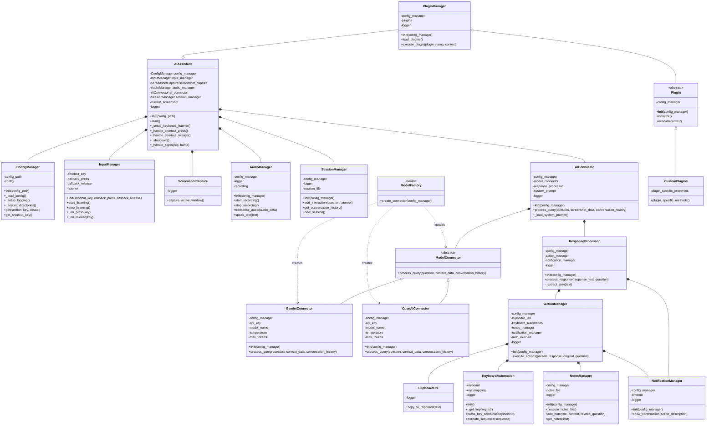

```mermaid
classDiagram
    %% Main Application Class
    class AIAssistant {
        -ConfigManager config_manager
        -InputManager input_manager
        -ScreenshotCapture screenshot_capture
        -AudioManager audio_manager
        -AIConnector ai_connector
        -SessionManager session_manager
        -current_screenshot
        -logger
        +__init__(config_path)
        +start()
        +_setup_keyboard_listener()
        +_handle_shortcut_press()
        +_handle_shortcut_release()
        +_shutdown()
        +_handle_signal(sig, frame)
    }

    %% Configuration
    class ConfigManager {
        -config_path
        -config
        +__init__(config_path)
        +_load_config()
        +_setup_logging()
        +_ensure_directories()
        +get(section, key, default)
        +get_shortcut_key()
    }

    %% Core Components
    class InputManager {
        -shortcut_key
        -callback_press
        -callback_release
        -listener
        +__init__(shortcut_key, callback_press, callback_release)
        +start_listening()
        +stop_listening()
        +_on_press(key)
        +_on_release(key)
    }

    class ScreenshotCapture {
        -logger
        +capture_active_window()
    }

    class AudioManager {
        -config_manager
        -logger
        -recording
        +__init__(config_manager)
        +start_recording()
        +stop_recording()
        +transcribe_audio(audio_data)
        +speak_text(text)
    }

    class SessionManager {
        -config_manager
        -logger
        -session_file
        +__init__(config_manager)
        +add_interaction(question, answer)
        +get_conversation_history()
        +new_session()
    }

    %% AI Components
    class AIConnector {
        -config_manager
        -model_connector
        -response_processor
        -system_prompt
        -logger
        +__init__(config_manager)
        +process_query(question, screenshot_data, conversation_history)
        +_load_system_prompt()
    }

    class ModelConnector {
        <<abstract>>
        +process_query(question, context_data, conversation_history)
    }

    class GeminiConnector {
        -config_manager
        -api_key
        -model_name
        -temperature
        -max_tokens
        +__init__(config_manager)
        +process_query(question, context_data, conversation_history)
    }

    class OpenAIConnector {
        -config_manager
        -api_key
        -model_name
        -temperature
        -max_tokens
        +__init__(config_manager)
        +process_query(question, context_data, conversation_history)
    }

    class ModelFactory {
        <<static>>
        +create_connector(config_manager)
    }

    %% New Action Components
    class ResponseProcessor {
        -config_manager
        -action_manager
        -notification_manager
        -logger
        +__init__(config_manager)
        +process_response(response_text, question)
        -_extract_json(text)
    }

    class ActionManager {
        -config_manager
        -clipboard_util
        -keyboard_automation
        -notes_manager
        -notification_manager
        -auto_execute
        -logger
        +__init__(config_manager)
        +execute_actions(parsed_response, original_question)
    }

    class ClipboardUtil {
        -logger
        +copy_to_clipboard(text)
    }

    class KeyboardAutomation {
        -keyboard
        -key_mapping
        -logger
        +__init__()
        +_get_key(key_str)
        +press_key_combination(shortcut)
        +execute_sequence(sequence)
    }

    class NotificationManager {
        -config_manager
        -timeout
        -logger
        +__init__(config_manager)
        +show_confirmation(action_description)
    }

    class NotesManager {
        -config_manager
        -notes_file
        -logger
        +__init__(config_manager)
        +_ensure_notes_file()
        +add_note(title, content, related_question)
        +get_notes(limit)
    }

    %% Plugin System
    class PluginManager {
        -config_manager
        -plugins
        -logger
        +__init__(config_manager)
        +load_plugins()
        +execute_plugin(plugin_name, context)
    }

    class Plugin {
        <<abstract>>
        -config_manager
        +__init__(config_manager)
        +initialize()
        +execute(context)
    }

    class CustomPlugins {
        -plugin_specific_properties
        +plugin_specific_methods()
    }

    %% Relationships
    AIAssistant *-- ConfigManager
    AIAssistant *-- InputManager
    AIAssistant *-- ScreenshotCapture
    AIAssistant *-- AudioManager
    AIAssistant *-- SessionManager
    AIAssistant *-- AIConnector
    
    AIConnector *-- ModelConnector
    AIConnector *-- ResponseProcessor
    
    ModelConnector <|-- GeminiConnector
    ModelConnector <|-- OpenAIConnector
    
    ModelFactory ..> ModelConnector : creates
    ModelFactory ..> GeminiConnector : creates
    ModelFactory ..> OpenAIConnector : creates
    
    ResponseProcessor *-- ActionManager
    ResponseProcessor *-- NotificationManager
    
    ActionManager *-- ClipboardUtil
    ActionManager *-- KeyboardAutomation
    ActionManager *-- NotesManager
    ActionManager *-- NotificationManager
    
    PluginManager --o AIAssistant
    Plugin <|-- CustomPlugins
    PluginManager o-- Plugin
``` 